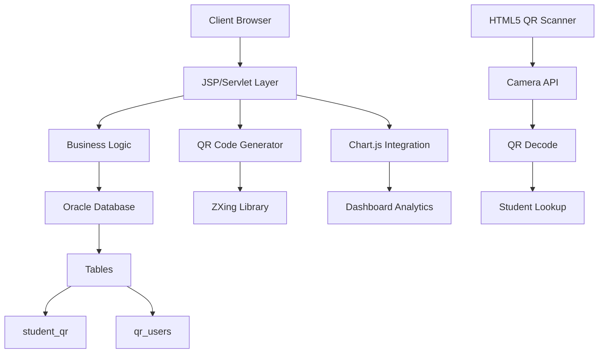

# 🎓 Student QR Management System

<div align="center">
  
```
   ██████╗████████╗██╗   ██╗██████╗ ███████╗███╗   ██╗████████╗     ██████╗ ██████╗ 
  ██╔════╝╚══██╔══╝██║   ██║██╔══██╗██╔════╝████╗  ██║╚══██╔══╝    ██╔═══██╗██╔══██╗
  ╚█████╗    ██║   ██║   ██║██║  ██║█████╗  ██╔██╗ ██║   ██║       ██║   ██║██████╔╝
   ╚═══██╗   ██║   ██║   ██║██║  ██║██╔══╝  ██║╚██╗██║   ██║       ██║▄▄ ██║██╔══██╗
  ██████╔╝   ██║   ╚██████╔╝██████╔╝███████╗██║ ╚████║   ██║       ╚██████╔╝██║  ██║
  ╚═════╝    ╚═╝    ╚═════╝ ╚═════╝ ╚══════╝╚═╝  ╚═══╝   ╚═╝        ╚══▀▀═╝ ╚═╝  ╚═╝
```

**A comprehensive web-based QR code management system for student information**

[](https://java.com/)
[](https://www.oracle.com/java/technologies/jspt.html)
[](https://www.oracle.com/database/)
[](https://html.spec.whatwg.org/)
[](https://www.w3.org/Style/CSS/)

</div>

---

## 📋 Table of Contents

- [📖 Overview](#-overview)
- [✨ Features](#-features)
- [🏗️ System Architecture](#️-system-architecture)
- [🚀 Getting Started](#-getting-started)
- [💾 Database Setup](#-database-setup)
- [📁 Project Structure](#-project-structure)
- [🔧 Configuration](#-configuration)
- [📱 Usage Guide](#-usage-guide)
- [🔐 Security Features](#-security-features)
- [🤝 Contributing](#-contributing)
- [📄 License](#-license)

---

## 📖 Overview

The **Student QR Management System** is a comprehensive web application designed to streamline student information management through QR code technology. This system enables educational institutions to digitize student records, generate unique QR codes for each student, and provide quick access to student information through QR scanning.

### 🎯 Key Objectives

- **Digital Transformation**: Convert traditional paper-based student records to digital format
- **Quick Access**: Instant retrieval of student information via QR code scanning
- **Data Security**: Role-based access control with secure authentication
- **Efficiency**: Streamlined student management for administrative staff

---

## ✨ Features

### 🔐 **Authentication & Authorization**
- **Multi-role Support**: Student and Admin user roles
- **Secure Login**: Session-based authentication system
- **Access Control**: Role-specific dashboard and functionality

### 👨‍🎓 **Student Management**
- **Registration**: Add new students with comprehensive details
- **Profile Management**: Edit and update student information
- **QR Generation**: Automatic QR code creation with student data
- **Bulk Operations**: Manage multiple student records efficiently

### 📊 **Admin Dashboard**
- **Statistics**: Visual branch-wise student distribution charts
- **Reports**: Generate comprehensive student reports
- **User Management**: Control user access and permissions
- **Print Services**: ID card generation and printing

### 📱 **QR Code Features**
- **Dynamic QR Codes**: Embedded with student information
- **Real-time Scanning**: HTML5-based QR scanner
- **Audio Feedback**: Voice announcements for successful scans
- **Image Storage**: QR codes stored as BLOB in Oracle database

### 🖨️ **Printing & Reports**
- **ID Card Generation**: Professional student ID cards with QR codes
- **Bulk Printing**: Print multiple ID cards simultaneously
- **Custom Templates**: Branded ID card designs
- **Export Options**: Multiple format support for reports

---

## 🏗️ System Architecture



### 🛠️ **Technology Stack**

| Component | Technology |
|-----------|------------|
| **Frontend** | HTML5, CSS3, JavaScript, Chart.js |
| **Backend** | Java JSP, Servlets |
| **Database** | Oracle Database 11g/12c |
| **QR Library** | ZXing (Zebra Crossing) |
| **Scanner** | HTML5-QRCode Library |
| **Charts** | Chart.js for analytics |
| **Server** | Apache Tomcat |

---

## 🚀 Getting Started

### 📋 Prerequisites

Before setting up the project, ensure you have:

- ☑️ **Java Development Kit (JDK) 8+**
- ☑️ **Apache Tomcat 9.0+**
- ☑️ **Oracle Database 11g/12c/19c**
- ☑️ **IDE**: Eclipse, IntelliJ IDEA, or NetBeans
- ☑️ **Web Browser**: Chrome, Firefox, or Safari (for QR scanning)

### 📦 Installation Steps

1. **Clone the Repository**
   ```bash
   git clone https://github.com/yourusername/student-qr-management.git
   cd student-qr-management
   ```

2. **Import Project**
   - Open your IDE
   - Import the project as a Dynamic Web Project
   - Add to Tomcat server

3. **Configure Dependencies**
   - Add Oracle JDBC driver (`ojdbc8.jar`)
   - Add ZXing library jars
   - Ensure all JAR files are in `WEB-INF/lib/`

4. **Deploy to Server**
   - Deploy the project to Tomcat
   - Start the server
   - Access via `http://localhost:8080/student-qr-management/`

---

## 💾 Database Setup

### 🗄️ **Database Schema**

Create the following tables in your Oracle database:

```sql
-- Students table with QR data
CREATE TABLE student_qr (
    regno VARCHAR2(20) PRIMARY KEY,
    name VARCHAR2(100) NOT NULL,
    branch VARCHAR2(50),
    mobile VARCHAR2(30),
    email VARCHAR2(100),
    qr_data CLOB,
    qr_image BLOB
);

-- Users authentication table
CREATE TABLE qr_users (
    username VARCHAR2(50) PRIMARY KEY,
    password VARCHAR2(100) NOT NULL,
    regno VARCHAR2(20),
    role VARCHAR2(20) DEFAULT 'STUDENT',
    cname VARCHAR2(200),
    CONSTRAINT fk_regno FOREIGN KEY (regno) REFERENCES student_qr(regno)
);
```

### 🔗 **Database Connection**

Update the connection parameters in your JSP files:

```java
String url = "jdbc:oracle:thin:@localhost:1521:xe";
String username = "system";
String password = "system";
```

### 📝 **Sample Data**

```sql
-- Insert sample student
INSERT INTO student_qr VALUES ('2023001', 'John Doe', 'CSE', '+1234567890', 'john@example.com', NULL, NULL);

-- Insert admin user
INSERT INTO qr_users VALUES ('admin', 'admin123', '2023001', 'ADMIN', 'Sample College');
```

---

## 📁 Project Structure

```
student-qr-management/
│
├── 📄 index.jsp                    # Landing page
├── 📄 login.jsp                    # User authentication
├── 📄 register.jsp                 # User registration
├── 📄 loginaction.jsp              # Login processing
│
├── 👨‍💼 Admin Module/
│   ├── 📄 adminDashboard.jsp       # Admin dashboard with charts
│   ├── 📄 manageStudent.jsp        # Student management
│   ├── 📄 printID.jsp              # ID card generation
│   └── 📄 editStudent.jsp          # Edit student details
│
├── 👨‍🎓 Student Module/
│   ├── 📄 studentDashboard.jsp     # Student profile view
│   ├── 📄 reg.jsp                  # Student registration form
│   ├── 📄 generateQR.jsp           # QR code generation
│   └── 📄 viewStudent.jsp          # View student records
│
├── 📱 QR Module/
│   ├── 📄 readQR.jsp               # QR code scanner
│   ├── 📄 getStudent.jsp           # Student data retrieval
│   └── 📄 ShowQRImageServlet.java  # QR image servlet
│
└── 🎨 Assets/
    ├── 📁 css/                     # Stylesheets
    ├── 📁 js/                      # JavaScript files
    └── 📁 images/                  # Static images
```

---

## 🔧 Configuration

### ⚙️ **Application Settings**

1. **Database Configuration**
   ```properties
   db.url=jdbc:oracle:thin:@localhost:1521:xe
   db.username=system
   db.password=system
   ```

2. **QR Code Settings**
   ```java
   // QR Code dimensions
   int QR_WIDTH = 250;
   int QR_HEIGHT = 250;
   
   // Image format
   String QR_FORMAT = "PNG";
   ```

3. **Session Configuration**
   ```xml
   <!-- web.xml -->
   <session-config>
       <session-timeout>30</session-timeout>
   </session-config>
   ```

### 🔐 **Security Configuration**

- **Session Management**: Automatic session timeout after inactivity
- **Role-based Access**: Different dashboards for Admin and Student roles
- **Input Validation**: Server-side validation for all forms
- **SQL Injection Prevention**: Parameterized queries throughout

---

## 📱 Usage Guide

### 👨‍💼 **For Administrators**

1. **Login**: Use admin credentials to access the dashboard
2. **View Analytics**: Check branch-wise student distribution charts
3. **Manage Students**: Add, edit, or delete student records
4. **Generate Reports**: Create and print student reports
5. **Print ID Cards**: Generate professional ID cards with QR codes

### 👨‍🎓 **For Students**

1. **Register**: Create account with registration number
2. **Login**: Access personal dashboard
3. **View Profile**: Check personal information and QR code
4. **Update Details**: Modify contact information (if permitted)

### 📱 **QR Code Scanning**

1. **Access Scanner**: Navigate to QR scanner page
2. **Allow Camera**: Grant camera permissions
3. **Scan Code**: Point camera at QR code
4. **View Results**: Get instant student information
5. **Audio Feedback**: Listen to voice confirmation

---

## 🔐 Security Features

### 🛡️ **Authentication**
- Session-based login system
- Password protection for all accounts
- Automatic logout on session timeout

### 🔒 **Authorization**
- Role-based access control (RBAC)
- Admin-only administrative functions
- Student access limited to own data

### 🚫 **Input Validation**
- Server-side form validation
- SQL injection prevention
- XSS protection measures

### 📊 **Audit Trail**
- User activity logging
- Database transaction records
- Error logging and monitoring

---

## 🤝 Contributing

We welcome contributions to improve the Student QR Management System!

### 📝 **How to Contribute**

1. **Fork** the repository
2. **Create** a feature branch (`git checkout -b feature/AmazingFeature`)
3. **Commit** your changes (`git commit -m 'Add some AmazingFeature'`)
4. **Push** to the branch (`git push origin feature/AmazingFeature`)
5. **Open** a Pull Request

### 🐛 **Bug Reports**

Please use the [Issues](https://github.com/yourusername/student-qr-management/issues) tab to report bugs with:
- Detailed description
- Steps to reproduce
- Expected vs actual behavior
- Screenshots (if applicable)

### 💡 **Feature Requests**

We're always looking for new ideas! Submit feature requests through the Issues tab.

---

## 📄 License

This project is licensed under the MIT License - see the [LICENSE.md](LICENSE.md) file for details.

```
MIT License

Copyright (c) 2024 Student QR Management System

Permission is hereby granted, free of charge, to any person obtaining a copy
of this software and associated documentation files (the "Software"), to deal
in the Software without restriction, including without limitation the rights
to use, copy, modify, merge, publish, distribute, sublicense, and/or sell
copies of the Software, and to permit persons to whom the Software is
furnished to do so, subject to the following conditions:

The above copyright notice and this permission notice shall be included in all
copies or substantial portions of the Software.
```

---

## 🙏 Acknowledgments

- **ZXing Library**: For QR code generation and processing
- **Chart.js**: For beautiful dashboard analytics
- **HTML5-QRCode**: For client-side QR scanning
- **Oracle**: For robust database management
- **Apache Tomcat**: For reliable web server hosting

---

<div align="center">

**Made with ❤️ for educational institutions worldwide**


</div>


## 📞 Support

Need help? Contact us:

- 📧 **Email**: singhamritraj898@gmail.com
- 💬 **Discord**: [Join our community](https://discord.gg/studentqr)
- 📖 **Documentation**: [Full Docs](https://docs.studentqr.com)
- 🐛 **Issues**: [GitHub Issues](https://github.com/yourusername/student-qr-management/issues)

---

<div align="center">

### 🌟 **Star this repository if it helped you!**

### 🌟 **Made with ❤️ by Amrit Raj Singh**


[⬆ Back to Top](#-student-qr-management-system)

</div>
